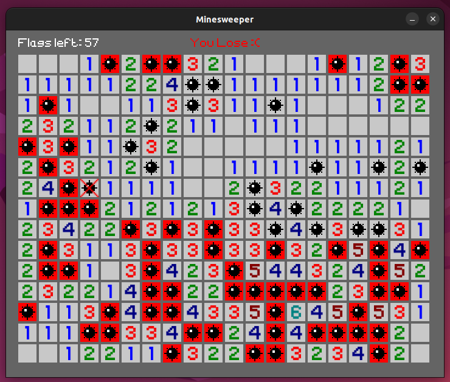

# Simple C++ Minesweeper
[](https://github.com/R-Besson)  



## Requirements
You will need :<br>
- c++ compiler (example: [g++](https://gcc.gnu.org/))
- [GNU make](https://www.gnu.org/software/make/) for building ([documentation](https://www.gnu.org/software/make/manual/make.html)),<br>
- [SFML](https://www.sfml-dev.org/index.php) for graphics (for example, you can install SFML with [MSYS2](https://www.msys2.org/) using `pacman -S mingw-w64-x86_64-sfml` from MSYS2 terminal in windows)

## Building
```
cd minesweeper
make
```
This will create a **build** directory with the executable and the assets (images, fonts, ...)<br>
Alternatively look in the **Makefile** file for compilation & linking instructions without using make

## Running
```
cd build
```
To show usage instructions run the executable using `./minesweeper` (linux) or `minesweeper.exe` (win) in the terminal